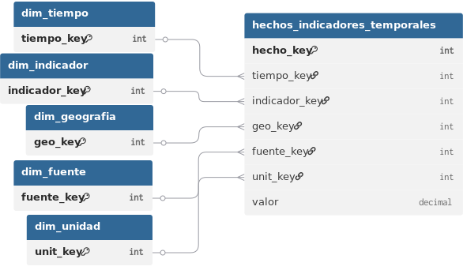
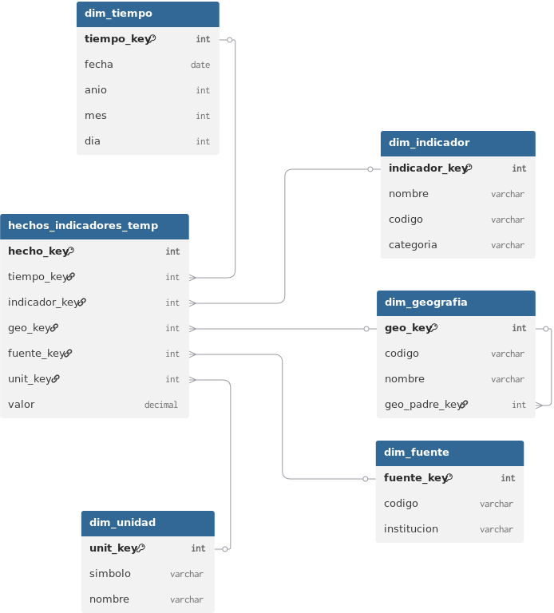
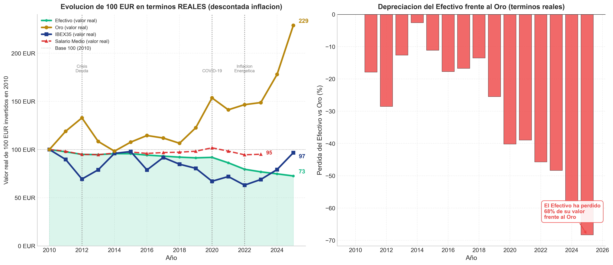
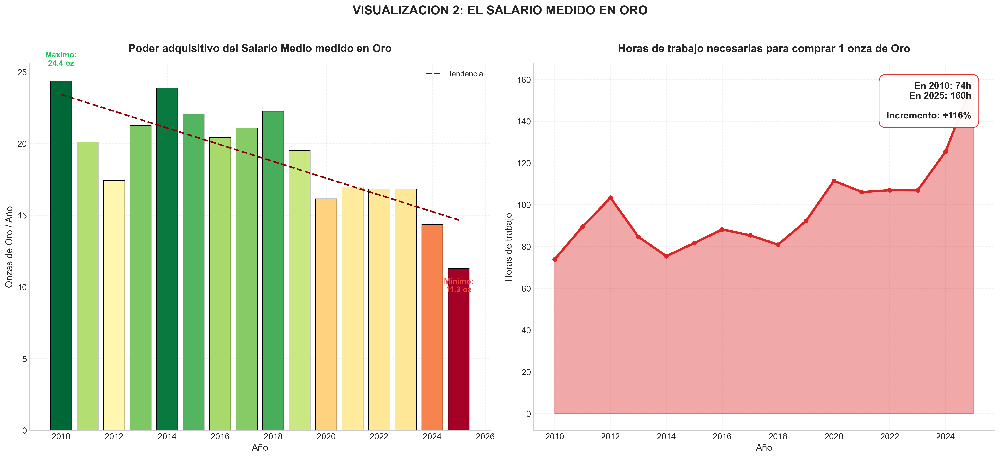
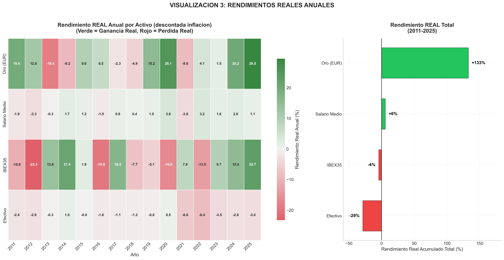
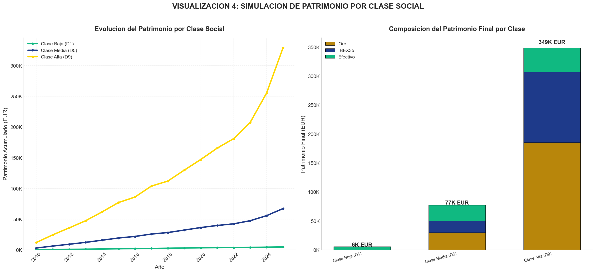
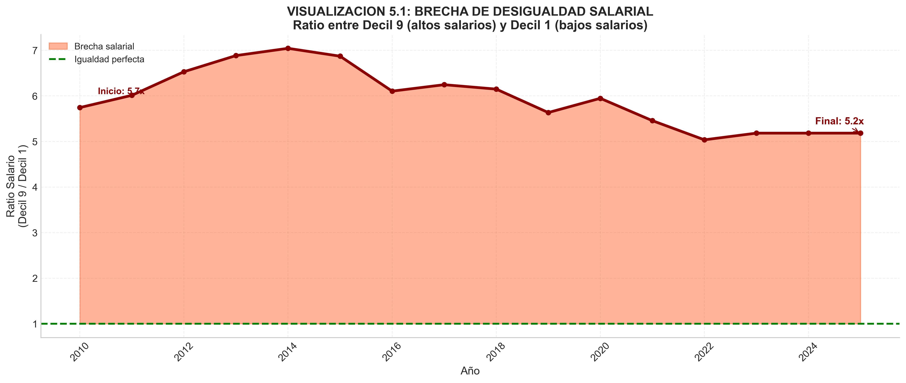
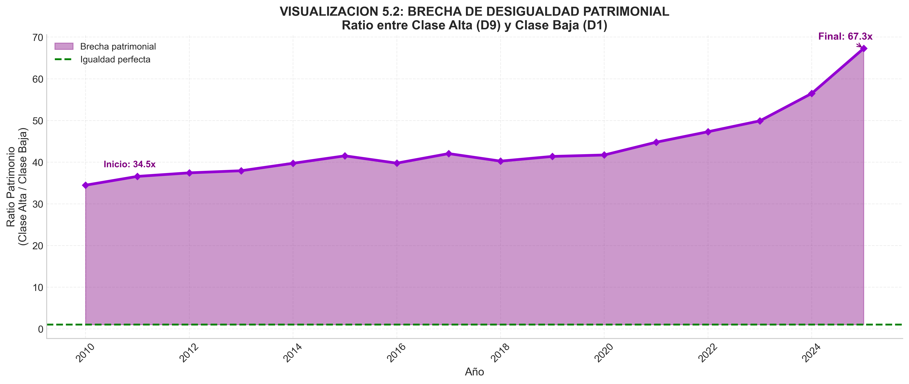

# MEMORIA DEL PROYECTO
## Depreciación del euro y erosión del poder adquisitivo en España (2010-2025)

**Repositorio GitHub:** https://github.com/JBLOZ/fiat_depreciacion

**Asignatura:** Adquisición y Preparación de Datos  
**Grado:** Ingeniería en Inteligencia Artificial  
**Universidad de Alicante - Escuela Politécnica Superior**

**Alejandro Martinez, Alejandro Parra, Mauro Carles, Jordi Blasco**

---

## ÍNDICE

1. [Definición del proyecto centrado en los datos](#1-definición-del-proyecto-centrado-en-los-datos)
2. [Analizar y evaluar necesidades de datos](#2-analizar-y-evaluar-necesidades-de-datos)
3. [Diseño conceptual, lógico y físico del almacén de datos](#3-diseño-conceptual-lógico-y-físico-del-almacén-de-datos)
4. [Limpieza, transformación y normalización de datos](#4-limpieza-transformación-y-normalización-de-datos)
5. [Transformación según schema.org](#5-transformación-según-schemaorg)
6. [Visualización](#6-visualización)
7. [Conclusiones y resultados](#7-conclusiones-y-resultados)
8. [Repositorio y guía de uso](#8-repositorio-y-guía-de-uso)

---

## 1. DEFINICIÓN DEL PROYECTO CENTRADO EN LOS DATOS

### 1.1 Introducción y contexto económico

Durante el periodo 2010-2025, la economía española ha atravesado múltiples crisis que han impactado profundamente en el bienestar de los hogares. El periodo comenzó con las secuelas de la crisis financiera de 2008, continuó con la crisis de deuda europea (2010-2012), experimentó una recuperación moderada (2014-2019), enfrentó el shock de la pandemia COVID-19 (2020-2021), y recientemente ha vivido un repunte inflacionario sin precedentes (2021-2024) motivado por disrupciones en cadenas de suministro y tensiones geopolíticas.

Este proyecto surge de una observación crítica: **las cifras oficiales de inflación (IPC) no capturan completamente la erosión del poder adquisitivo real de los ciudadanos**. Mientras el IPC oficial ha mostrado tasas moderadas en la mayor parte del periodo (con excepciones puntuales), otros indicadores económicos revelan una historia diferente:

- El **euro ha perdido valor** frente al dólar estadounidense de forma significativa
- Los **salarios nominales** han crecido por debajo de la inflación en muchos años
- Los **activos refugio** como el oro han experimentado revalorizaciones masivas
- La **brecha de desigualdad** se ha ampliado, no solo en ingresos, sino especialmente en patrimonio acumulado

Este fenómeno, que algunos economistas denominan **"inflación oculta"**, se manifiesta cuando medimos el bienestar económico no en euros nominales, sino en capacidad real de adquisición de bienes, servicios y activos tangibles.

### 1.2 Problemática y motivación

La problemática central que aborda este proyecto se puede resumir en las siguientes preguntas:

**¿Qué ha pasado realmente con nuestro poder adquisitivo en los últimos 15 años?**

Esta pregunta aparentemente simple esconde múltiples dimensiones:

- **Dimensión monetaria:** ¿Cuánto valor ha perdido el euro como unidad de cuenta?
- **Dimensión laboral:** ¿Han crecido los salarios al mismo ritmo que los precios?
- **Dimensión patrimonial:** ¿Qué estrategias de ahorro/inversión han protegido mejor el patrimonio?
- **Dimensión social:** ¿Se ha ampliado la brecha entre quienes tienen acceso a activos refugio y quienes no?

La motivación de este proyecto es **cuantificar con datos objetivos** estas dimensiones y proporcionar un análisis riguroso que vaya más allá de la narrativa oficial. Para ello, integramos:

- Datos macroeconómicos oficiales (INE, BCE)
- Datos de mercados financieros (bolsa española, mercado del oro)
- Análisis de distribución salarial por deciles
- Simulaciones de acumulación patrimonial según perfiles socioeconómicos

### 1.3 Preguntas de investigación

Para estructurar el análisis, hemos definido cinco preguntas de investigación específicas:

#### **Pregunta 1: Evolución de activos vs. efectivo**
*¿Cómo ha evolucionado el valor real de una inversión inicial de 100€ en diferentes activos (efectivo, oro, IBEX-35, salario medio) durante el periodo 2010-2025, ajustado por inflación?*

**Justificación:** Esta pregunta nos permite comparar visualmente la preservación de valor de diferentes estrategias de ahorro. El efectivo representa la "no-estrategia" (dejar el dinero sin invertir), mientras que oro y bolsa representan activos refugio tradicionales. El salario medio actúa como proxy del poder adquisitivo del trabajador promedio.

#### **Pregunta 2: Inflación oculta medida en oro**
*¿Cuál es la "inflación oculta" si medimos el salario medio español en onzas de oro en lugar de en euros nominales?*

**Justificación:** El oro ha sido históricamente una unidad de medida de valor estable a largo plazo. Si el salario en euros sube pero en oro baja, significa que el dinero está perdiendo valor más rápido que lo que refleja el IPC oficial. Esta pregunta revela la depreciación real de la moneda fiat.

#### **Pregunta 3: Rendimientos reales por activo**
*¿Qué activos han ofrecido rendimientos reales positivos (después de inflación) de forma consistente durante 2010-2025?*

**Justificación:** Para un ciudadano que busca preservar su patrimonio, es crucial saber qué instrumentos financieros han funcionado realmente. Esta pregunta identifica cuáles han sido los "ganadores" y "perdedores" en términos de rentabilidad real.

#### **Pregunta 4: Impacto de la capacidad de ahorro por decil salarial**
*¿Cómo afecta la capacidad de ahorro y la estrategia de inversión a la acumulación de patrimonio según el decil salarial al que se pertenece?*

**Justificación:** No todos los ciudadanos tienen la misma capacidad de ahorro. Esta pregunta simula escenarios realistas para tres perfiles (clase baja, media y alta) y muestra cómo pequeñas diferencias en ingresos se amplifican dramáticamente cuando se combina ahorro con acceso a activos que baten la inflación.

#### **Pregunta 5: Desigualdad salarial vs. desigualdad patrimonial**
*¿En qué medida la brecha de desigualdad patrimonial supera a la brecha salarial debido al acceso diferencial a activos refugio?*

**Justificación:** Esta pregunta evidencia un efecto multiplicador oculto: aunque dos personas tengan salarios relativamente similares, si una invierte en activos que baten la inflación y la otra mantiene efectivo, la brecha patrimonial crece exponencialmente. Este es un factor clave en el aumento de la desigualdad en sociedades desarrolladas.

### 1.4 Objetivos del proyecto

#### Objetivos académicos (relacionados con la asignatura)

1. **Integración de fuentes heterogéneas:** Combinar datasets con diferentes formatos (CSV, APIs), frecuencias temporales (anual, mensual, diario) y fuentes (institucionales, mercados)
2. **Diseño de almacén de datos analítico:** Implementar un modelo estrella que permita consultas temporales complejas
3. **Proceso ETL reproducible:** Desarrollar un pipeline completo usando Pentaho Data Integration y scripts Python
4. **Transformación semántica:** Convertir los datos a formato JSON-LD usando vocabulario schema.org
5. **Visualización orientada a insight:** Generar gráficos que respondan directamente a las preguntas de investigación

#### Objetivos técnicos

1. **Automatización de descarga de datos:** Script `descarga_datasets.py` que obtiene datos financieros desde Yahoo Finance (oro, EUR/USD, IBEX-35)
2. **Limpieza robusta de datos:** Gestionar valores faltantes, outliers, inconsistencias de formato y problemas de encoding (UTF-8)
3. **Base de datos contenedorizada:** Desplegar MySQL usando Docker Compose para garantizar reproducibilidad en cualquier entorno
4. **Modelo dimensional escalable:** Diseño que permita añadir nuevos indicadores o periodos temporales sin modificar la estructura
5. **Exportación de datos procesados:** Facilitar el acceso a los datos limpios para análisis externos

#### Objetivos analíticos

1. **Cuantificar la inflación oculta:** Demostrar numéricamente la diferencia entre IPC oficial y depreciación real de la moneda
2. **Identificar activos refugio efectivos:** Determinar qué instrumentos han protegido mejor el patrimonio en el periodo
3. **Visualizar la desigualdad patrimonial:** Mostrar cómo el acceso a activos amplifica las diferencias económicas
4. **Simular escenarios realistas:** Proyectar la evolución patrimonial de diferentes perfiles socioeconómicos

### 1.5 Casos de uso

#### Caso de uso 1: Análisis de portafolios para particulares
**Actor:** Ciudadano con capacidad de ahorro que busca preservar su patrimonio  
**Objetivo:** Decidir cómo distribuir sus ahorros entre diferentes activos  
**Valor aportado:** Las visualizaciones de rendimientos reales permiten tomar decisiones informadas basadas en datos históricos

#### Caso de uso 2: Investigación económica
**Actor:** Economista o investigador social  
**Objetivo:** Analizar la evolución de la desigualdad patrimonial en España  
**Valor aportado:** El almacén de datos integra múltiples indicadores que permiten estudiar correlaciones entre salarios, inflación y patrimonio

#### Caso de uso 3: Educación financiera
**Actor:** Docente de economía o finanzas personales  
**Objetivo:** Explicar conceptos como inflación, inversión y desigualdad con datos reales  
**Valor aportado:** Las visualizaciones son didácticas y basadas en datos oficiales, ideales para contextos educativos

#### Caso de uso 4: Auditoría de políticas públicas
**Actor:** Analista de políticas económicas  
**Objetivo:** Evaluar la efectividad de las políticas salariales y monetarias en preservar el poder adquisitivo  
**Valor aportado:** El proyecto proporciona métricas objetivas sobre la erosión del poder adquisitivo que complementan estadísticas oficiales


---

## 2. ANALIZAR Y EVALUAR NECESIDADES DE DATOS

### 2.1 Metodología de selección de datos

La selección de datasets se ha realizado siguiendo un proceso estructurado de tres fases:

#### Fase 1: Identificación de dominios clave
Basándonos en las preguntas de investigación, identificamos cinco dominios de datos necesarios:
1. **Precios y inflación** → IPC del INE
2. **Mercado laboral** → Salarios y empleo del INE
3. **Mercados financieros** → IBEX-35 (Yahoo Finance)
4. **Activos refugio** → Oro (Yahoo Finance)
5. **Tipos de cambio** → EUR/USD (Yahoo Finance)

#### Fase 2: Evaluación de fuentes disponibles
Para cada dominio, evaluamos múltiples fuentes según criterios de:
- **Oficialidad:** ¿Es una fuente gubernamental o institucional reconocida?
- **Cobertura temporal:** ¿Cubre todo el periodo 2010-2025?
- **Granularidad:** ¿Ofrece el nivel de detalle necesario?
- **Accesibilidad:** ¿Es posible descargar los datos de forma automatizada o manual?
- **Formato:** ¿Está en formato estructurado (CSV, API)?

#### Fase 3: Validación cruzada
Cuando fue posible, contrastamos datos de múltiples fuentes para validar su consistencia. Por ejemplo:
- El tipo de cambio EUR/USD se verificó contra datos del BCE
- El IPC se cruzó con informes oficiales del INE publicados en PDF

### 2.2 Datasets seleccionados y su justificación

A continuación, detallamos cada conjunto de datos utilizado, su origen, formato y justificación:

#### **Dataset 1: IPC (Índice de Precios al Consumo)**

**Fuente:** Instituto Nacional de Estadística (INE)  
**Formato:** CSV descargado manualmente desde INE.es  
**Cobertura temporal:** 2010-2021 (anual)  
**Frecuencia:** Anual  
**Variables clave:** IPC general, IPC por tipos (Tipo 1: Alimentación, Tipo 4: Vivienda, Tipo 11: Ocio)

**Justificación:** El IPC es el indicador oficial de inflación en España. Es fundamental para:
- Deflactar valores nominales (salarios, inversiones) a términos reales
- Comparar el coste de la vida entre diferentes años
- Calcular rendimientos reales de activos financieros

**Limitación conocida:** El IPC ha sido criticado por subestimar la inflación real experimentada por los hogares, especialmente en productos básicos. Sin embargo, al ser la métrica oficial, es la referencia estándar para análisis económicos.

**Archivos procesados:**
- `ipc/ipc_general_anual_2010_2021.csv`
- `ipc/ipc_tipo_1_2010_2021.csv` (Alimentación)
- `ipc/ipc_tipo_4_2010_2021.csv` (Vivienda)
- `ipc/ipc_tipo_11_2010_2021.csv` (Ocio y cultura)

#### **Dataset 2: Salarios**

**Fuente:** Instituto Nacional de Estadística (INE) - Encuesta de Estructura Salarial y Encuesta Anual de Coste Laboral  
**Formato:** CSV descargado manualmente desde INE.es  
**Cobertura temporal:** 2010-2023 (anual/mensual según indicador)  
**Frecuencia:** Anual y mensual  
**Variables clave:** 
- Salario medio anual
- Salario mediano anual
- Salario más frecuente anual
- Salario mensual por deciles (10 grupos de 10% de población cada uno)

**Justificación:** Los salarios son la principal fuente de ingresos de los hogares españoles. Este dataset permite:
- Analizar la evolución del poder adquisitivo del trabajador promedio
- Estudiar la desigualdad salarial mediante la distribución por deciles
- Comparar salarios nominales vs. reales (ajustados por IPC)
- Simular escenarios de ahorro según nivel salarial


**Archivos procesados:**
- `salarios/salario_anual_medio_mediano_frecuente_2010_2023.csv`
- `salarios/Salario_mensual_deciles_2010_2023.csv`

#### **Dataset 3: Empleo y desempleo**

**Fuente:** Instituto Nacional de Estadística (INE) - Encuesta de Población Activa (EPA)  
**Formato:** CSV descargado manualmente desde INE.es  
**Cobertura temporal:** 2010-2024 (asalariados), 2010-2025 (desempleo)  
**Frecuencia:** Trimestral/anual  
**Variables clave:**
- Asalariados indefinidos vs. temporales (total)
- Tasa de desempleo por grupos de edad (12 rangos: 16-19, 20-24, ..., 70 y más)

**Justificación:** El mercado laboral es un contexto fundamental para interpretar la evolución salarial:
- **Temporalidad:** Un alto porcentaje de contratos temporales reduce el poder de negociación salarial
- **Desempleo juvenil:** Afecta desproporcionadamente a ciertos grupos etarios, impactando su capacidad de ahorro a largo plazo
- **Estabilidad laboral:** La precariedad limita el acceso a financiación (hipotecas) y activos refugio

**Archivos procesados:**
- `empleo/Asalariados_indefinidos_o_temporales_2010_2024.csv`
- `empleo/Desempleo_porcentaje_edades_2010_2025.csv`

#### **Dataset 4: IBEX-35**

**Fuente:** Yahoo Finance (ticker `^IBEX`)  
**Formato:** CSV descargado automáticamente vía API de `yfinance`  
**Cobertura temporal:** 2010-2025 (diaria)  
**Frecuencia:** Diaria (días hábiles)  
**Variables clave:** Precio de cierre, máximo, mínimo, volumen, retornos logarítmicos

**Justificación:** El IBEX-35 es el principal índice bursátil español y representa la inversión en renta variable doméstica. Permite:
- Evaluar la rentabilidad de una cartera de acciones españolas
- Comparar el rendimiento de la bolsa vs. otros activos refugio
- Identificar periodos de volatilidad (crisis financieras)


**Archivos procesados:**
- `indices_bursatiles/ibex35_daily.csv`

#### **Dataset 5: Oro (precio en USD)**

**Fuente:** Yahoo Finance (ticker `GC=F` - Gold Futures)  
**Formato:** CSV descargado automáticamente vía API de `yfinance`  
**Cobertura temporal:** 2010-2025 (diaria)  
**Frecuencia:** Diaria (días hábiles)  
**Variables clave:** Precio de cierre (USD/onza troy), máximo, mínimo, volumen

**Justificación:** El oro es históricamente el activo refugio por excelencia. Permite:
- Medir la depreciación de las monedas fiat (euro, dólar)
- Evaluar si el oro ha protegido el patrimonio durante crisis
- Calcular la "inflación oculta" expresando salarios en onzas de oro

**Conversión a euros:** El precio original está en USD. Utilizamos el tipo de cambio EUR/USD para convertirlo a EUR/onza, generando un indicador más relevante para el análisis español. Esta conversión se realiza en Pentaho mediante la transformación `Transformacion_10.ktr`.

**Archivos procesados:**
- `oro/gold_price_usd.csv` (original en USD)
- `oro/precio_oro_euros.csv` (convertido a EUR)

#### **Dataset 6: Tipo de cambio EUR/USD**

**Fuente:** Yahoo Finance (ticker `EURUSD=X`) / Banco Central Europeo (validación)  
**Formato:** CSV descargado automáticamente vía API de `yfinance`  
**Cobertura temporal:** 2010-2025 (diaria)  
**Frecuencia:** Diaria  
**Variables clave:** Tipo de cambio oficial de cierre

**Justificación:** El tipo de cambio EUR/USD es fundamental para:
- Convertir el precio del oro (cotizado en USD) a euros

**Archivos procesados:**
- `tipo_cambio/eur_usd_exchange_rate.csv`

### 2.3 Análisis de necesidades de enriquecimiento

#### Enriquecimiento 1: Conversión oro USD → EUR
**Necesidad:** El oro cotiza en USD, pero analizamos la economía española en EUR  
**Solución:** Join temporal diario entre precio oro USD y tipo de cambio EUR/USD  
**Implementación:** Transformación Pentaho `Transformacion_10.ktr`  
**Fórmula:** `Precio_EUR = Precio_USD / Tipo_Cambio_EURUSD`

#### Enriquecimiento 2: Salarios reales (deflactados)
**Necesidad:** Los salarios nominales no reflejan el poder adquisitivo real  
**Solución:** Deflactar salarios usando IPC base 2010=100  
**Implementación:** Calculado en visualizaciones finales (notebook Python)  
**Fórmula:** `Salario_Real = Salario_Nominal / (IPC/100)`

#### Enriquecimiento 3: Rendimientos reales
**Necesidad:** Evaluar rentabilidad neta de inflación  
**Solución:** Calcular rendimiento nominal y restar inflación  
**Implementación:** Calculado en visualizaciones finales  
**Fórmula:** `Rendimiento_Real = Rendimiento_Nominal - Inflación`

#### Enriquecimiento 4: Indicadores de desigualdad
**Necesidad:** Cuantificar la brecha salarial y patrimonial  
**Solución:** Calcular ratios entre deciles extremos  
**Implementación:** Calculado en visualizaciones finales  
**Fórmulas:**
- `Brecha_Salarial = Salario_Decil_9 / Salario_Decil_1`
- `Brecha_Patrimonial = Patrimonio_Alto / Patrimonio_Bajo`

### 2.4 Datos no utilizados (y por qué)

Durante la fase de exploración, evaluamos otros datasets que finalmente no se incluyeron:

1. **Euríbor (tipos de interés hipotecarios):** Aunque relevante para el coste de la vivienda, la mayoría de los deciles bajos no acceden a hipotecas, limitando su utilidad analítica
2. **Precio de la vivienda:** Altamente correlacionado con IPC-Vivienda, y su inclusión no aportaba información adicional significativa
3. **Bitcoin y otras criptomonedas:** Su historia comienza en 2010-2013, con volatilidad extrema. No son representativas de una estrategia de ahorro estándar para el ciudadano medio
4. **DAX, FTSE, S&P 500 (índices internacionales):** Aunque interesantes para comparaciones, el enfoque del proyecto es la economía española, y queríamos usar un activo no tan rentable para comprobar si al menos el IBEX-35 conseguía vencer la inflación. 

### 2.5 Justificación de ausencia de datos ficticios

**Todos los datos utilizados en este proyecto son reales y provienen de fuentes oficiales.** No se han generado datos sintéticos ni ficticios por las siguientes razones:

1. **Disponibilidad suficiente:** Las fuentes seleccionadas (INE, Yahoo Finance, BCE) proporcionan series históricas completas para el periodo analizado
2. **Credibilidad del análisis:** El uso de datos reales otorga validez a las conclusiones económicas extraídas
3. **Reproducibilidad:** Cualquier persona puede descargar los mismos datos y verificar los resultados
4. **Requisitos académicos:** El enunciado permite datos ficticios solo si es justificado, pero no fue necesario

---

## 3. DISEÑO CONCEPTUAL, LÓGICO Y FÍSICO DEL ALMACÉN DE DATOS

### 3.1 Justificación del modelo en estrella

Para este proyecto hemos adoptado un **modelo dimensional en estrella** (Star Schema) por las siguientes razones:

1. **Orientación analítica:** Los modelos en estrella están optimizados para consultas OLAP (Online Analytical Processing), que son el tipo de consultas que realizamos: agregaciones temporales, comparaciones entre indicadores, drill-down por dimensiones
2. **Simplicidad:** La estructura tabla de hechos + dimensiones es intuitiva y fácil de entender para usuarios no técnicos
3. **Performance:** Las consultas de agregación (SUM, AVG, COUNT) sobre hechos son muy eficientes gracias a la desnormalización parcial
4. **Escalabilidad:** Es sencillo añadir nuevos indicadores (filas en la tabla de hechos) o nuevas dimensiones sin modificar la estructura existente

**Alternativas consideradas y descartadas:**

- **Modelo Snowflake:** Ofrece mayor normalización (dimensiones normalizadas), pero añade complejidad de JOINs innecesaria para nuestro caso de uso
- **Modelo OLTP normalizado (3NF):** Optimizado para transacciones, no para análisis. Requeriría múltiples JOINs para consultas simples
- **Data Vault:** Diseño híbrido para entornos empresariales grandes. Excesivo para la escala de este proyecto académico

### 3.2 Diseño conceptual

El diseño conceptual se basa en el paradigma **"eventos + contexto"**:

- **Evento (hecho):** Una observación económica en un momento del tiempo  
  *Ejemplo: "El IPC general de España en enero de 2015 fue 100.85"*
  
- **Contexto (dimensiones):** Información que describe las circunstancias del evento  
  *¿Cuándo? → Dimensión Tiempo*  
  *¿Qué indicador? → Dimensión Indicador*  
  *¿Dónde? → Dimensión Geografía*  
  *¿De dónde viene el dato? → Dimensión Fuente*  
  *¿En qué unidad? → Dimensión Unidad*

#### Diagrama conceptual (textual)



### 3.3 Diseño lógico

El diseño lógico traduce el modelo conceptual a estructuras de tablas relacionales con sus claves primarias, foráneas y constraints.

#### Tabla de hechos: `hechos_indicadores_temporales`

| Campo | Tipo | Descripción | Constraints |
|-------|------|-------------|-------------|
| `hecho_key` | INT | Identificador único del hecho | PK, AUTO_INCREMENT |
| `tiempo_key` | INT | Referencia a la fecha | FK → dim_tiempo.tiempo_key, NOT NULL |
| `indicador_key` | INT | Referencia al indicador económico | FK → dim_indicador.indicador_key, NOT NULL |
| `geo_key` | INT | Referencia a la ubicación geográfica | FK → dim_geografia.geo_key, NOT NULL |
| `fuente_key` | INT | Referencia a la fuente de datos | FK → dim_fuente.fuente_key, NOT NULL |
| `unit_key` | INT | Referencia a la unidad de medida | FK → dim_unidad.unit_key, NOT NULL |
| `valor` | DECIMAL(20,6) | Valor numérico de la observación | NOT NULL |

**Índices:**
- PK sobre `hecho_key`
- Índice compuesto sobre `(tiempo_key, indicador_key)` para consultas temporales frecuentes
- Índices individuales sobre todas las FKs para acelerar JOINs

**Estimación de volumen:** Con ~50 indicadores x 15 años x 12 meses ≈ 9,000 registros (orden de magnitud, algunos indicadores son diarios → puede llegar a 100k filas)

#### Dimensión Tiempo: `dim_tiempo`

| Campo | Tipo | Descripción | Constraints |
|-------|------|-------------|-------------|
| `tiempo_key` | INT | Identificador único | PK, AUTO_INCREMENT |
| `fecha` | DATE | Fecha completa (YYYY-MM-DD) | NOT NULL, UNIQUE |
| `anio` | SMALLINT | Año extraído | NOT NULL |
| `mes` | TINYINT | Mes (1-12) | NULL (para datos solo anuales) |
| `dia` | TINYINT | Día (1-31) | NULL (para datos anuales/mensuales) |
| `trimestre` | TINYINT | Trimestre (1-4) | NULL |
| `nombre_mes` | VARCHAR(20) | Nombre del mes ("Enero", etc.) | NULL |
| `es_festivo` | BOOLEAN | Indica si es día festivo | DEFAULT FALSE |

**Decisiones de diseño:**
- `fecha` es UNIQUE para evitar duplicados temporales
- Campos `mes` y `dia` permiten NULL para datos con granularidad anual
- Se incluyen atributos derivados (trimestre, nombre_mes) para facilitar consultas y reducir cálculos repetitivos en el frontend

#### Dimensión Indicador: `dim_indicador`

| Campo | Tipo | Descripción | Constraints |
|-------|------|-------------|-------------|
| `indicador_key` | INT | Identificador único | PK, AUTO_INCREMENT |
| `nombre` | VARCHAR(200) | Nombre descriptivo del indicador | NOT NULL |
| `descripcion` | TEXT | Descripción extendida | NULL |
| `codigo` | VARCHAR(50) | Código abreviado único | NOT NULL, UNIQUE |
| `categoria` | VARCHAR(100) | Categoría temática (ej: "Salarios", "IPC") | NOT NULL |
| `es_agregable` | BOOLEAN | Indica si tiene sentido sumar este indicador | DEFAULT TRUE |
| `unidad_base` | VARCHAR(20) | Unidad de medida textual (ej: "EUR", "%") | NULL |

**Ejemplos de registros:**

| indicador_key | nombre | codigo | categoria | es_agregable | unidad_base |
|---------------|--------|--------|-----------|--------------|-------------|
| 1 | IPC General | IPC_GENERAL | IPC | FALSE | Índice base 100 |
| 5 | Salario Medio Anual | SAL_MEDIO_ANUAL | Salarios | TRUE | EUR |
| 15 | Desempleo 20-24 | DES_20_24 | Desempleo | FALSE | % |
| 23 | Precio Oro EUR | ORO_EUR | Activos | FALSE | EUR/oz |
| 30 | IBEX-35 Cierre | IBEX_CIERRE | Índices Bursátiles | FALSE | Puntos |

**Generación de indicadores:**
Algunos indicadores (como los 12 rangos de edad del desempleo y los 10 deciles salariales) se generaron programáticamente mediante el script `nuevos_indicadores.py`, que inserta registros automáticamente en la tabla evitando duplicados con `INSERT IGNORE`.

#### Dimensión Geografía: `dim_geografia`

| Campo | Tipo | Descripción | Constraints |
|-------|------|-------------|-------------|
| `geo_key` | INT | Identificador único | PK, AUTO_INCREMENT |
| `codigo` | VARCHAR(10) | Código abreviado | NOT NULL, UNIQUE |
| `nombre` | VARCHAR(100) | Nombre completo | NOT NULL |
| `codigo_iso` | VARCHAR(5) | Código ISO (ej: "ES", "EU") | NULL |
| `tipo` | VARCHAR(20) | Tipo de entidad ("País", "Región", "Global") | NOT NULL |
| `geo_padre_key` | INT | Clave del padre jerárquico | FK → dim_geografia.geo_key, NULL |
| `nivel_jerarquia` | TINYINT | Nivel en la jerarquía (1=país, 2=región) | NULL |
| `poblacion` | BIGINT | Población (si aplica) | NULL |

**Jerarquía geográfica:**
```
Global (geo_key=1)
 └── Europa (geo_key=2, geo_padre_key=1)
      └── España (geo_key=3, geo_padre_key=2)
           ├── Andalucía (geo_key=4, geo_padre_key=3)
           ├── Cataluña (geo_key=5, geo_padre_key=3)
           └── ...
```

**Para este proyecto:** Principalmente usamos dos valores:
- `"ESP"` → España (datos nacionales)
- `"GLOBAL"` → Datos internacionales (oro, EUR/USD)

#### Dimensión Fuente: `dim_fuente`

| Campo | Tipo | Descripción | Constraints |
|-------|------|-------------|-------------|
| `fuente_key` | INT | Identificador único | PK, AUTO_INCREMENT |
| `codigo` | VARCHAR(20) | Código abreviado | NOT NULL, UNIQUE |
| `institucion` | VARCHAR(150) | Nombre de la institución | NOT NULL |
| `url_base` | VARCHAR(500) | URL de la fuente | NULL |
| `licencia` | VARCHAR(50) | Tipo de licencia de los datos | NULL |
| `pais_origen` | VARCHAR(3) | País de origen (código ISO) | NULL |
| `frecuencia_actualizacion` | INT | Días entre actualizaciones | NULL |
| `contacto_responsable` | VARCHAR(100) | Email de contacto | NULL |
| `fecha_ultima_actualizacion` | DATE | Fecha de última actualización | NULL |
| `confiabilidad` | VARCHAR(10) | Nivel de confiabilidad ("Alta", "Media") | NULL |

**Ejemplos de registros:**

| fuente_key | codigo | institucion | url_base | licencia |
|------------|--------|-------------|----------|----------|
| 1 | INE | Instituto Nacional de Estadística | https://www.ine.es | Datos abiertos |
| 2 | BCE | Banco Central Europeo | https://www.ecb.europa.eu | Datos públicos |
| 3 | YAHOO_FINANCE | Yahoo Finance API | https://finance.yahoo.com | Uso personal |

#### Dimensión Unidad: `dim_unidad`

| Campo | Tipo | Descripción | Constraints |
|-------|------|-------------|-------------|
| `unit_key` | INT | Identificador único | PK, AUTO_INCREMENT |
| `simbolo` | VARCHAR(20) | Símbolo de la unidad | NOT NULL, UNIQUE |
| `nombre_completo` | VARCHAR(100) | Nombre descriptivo | NOT NULL |
| `tipo` | VARCHAR(50) | Tipo de unidad ("Monetaria", "Porcentaje", etc.) | NULL |
| `es_porcentaje` | BOOLEAN | Indica si es un porcentaje | DEFAULT FALSE |
| `precision_decimal` | TINYINT | Decimales recomendados | NULL |

**Ejemplos de registros:**

| unit_key | simbolo | nombre_completo | tipo | es_porcentaje | precision_decimal |
|----------|---------|-----------------|------|---------------|-------------------|
| 1 | EUR | Euro | Monetaria | FALSE | 2 |
| 2 | % | Porcentaje | Relativo | TRUE | 2 |
| 3 | Índice 100 | Índice base 100 | Índice | FALSE | 2 |
| 4 | EUR/oz | Euros por onza troy | Monetaria (relativa) | FALSE | 2 |
| 5 | Puntos | Puntos de índice bursátil | Índice | FALSE | 2 |

### 3.4 Diseño físico

El diseño físico implementa el modelo lógico en un SGBD concreto: **MySQL 8.0**.

#### Tecnologías y herramientas utilizadas

1. **MySQL Workbench:** Herramienta visual para diseñar el modelo ER, generar el script SQL de creación y exportar diagrama
2. **Docker Compose:** Orquestación del contenedor MySQL con copias de seguridad


#### Configuración de Docker Compose

El archivo `docker-compose.yml` define el servicio MySQL

**Características:**
- Puerto 3306 expuesto para conexiones externas (Pentaho, Python)
- Inicialización automática mediante script en `/docker-entrypoint-initdb.d/`
- Contraseña root: `root` (solo para desarrollo local)
- Base de datos creada automáticamente: `fiat_depreciacion_dw`

#### Optimizaciones de rendimiento

1. **Índices estratégicos:**
   - Índice compuesto `(tiempo_key, indicador_key)` en la tabla de hechos → Acelera consultas tipo "¿Cómo ha evolucionado el indicador X en el tiempo?"
   - Índices UNIQUE en códigos de dimensiones → Evitan duplicados y aceleran búsquedas por código
   - Índices en claves foráneas → Optimizan JOINs

2. **Tipos de datos optimizados:**
   - `DECIMAL(20,6)` para valores económicos → Precisión suficiente sin overhead de DOUBLE
   - `SMALLINT` para años → Ahorra espacio vs. INT
   - `TINYINT` para meses, días, trimestres → Rango 0-255 es suficiente

3. **Collation UTF-8:**
   - `utf8mb4_unicode_ci` → Soporta caracteres especiales españoles (acentos, ñ) y emojis, pese a haber intentando en todo momento limpiar los csv en UTF-8 normal (es un por si acaso)


#### Estrategia de backups

**Backup inicial (`backup_completo.sql`):**
- Generado después de cargar las primeras transformaciones Pentaho
- Incluye estructura completa + datos de prueba de 2-3 indicadores
- Tamaño: ~500 KB
- Propósito: Checkpoint para volver atrás si algo falla en cargas posteriores

**Backup final (`backup_completo_v2.sql`):**
- Generado al finalizar todas las transformaciones
- Incluye estructura + TODOS los datos procesados (~9,000-100,000 filas en hechos)
- Tamaño: ~5-10 MB
- Propósito: Estado final reproducible del proyecto


### 3.5 Diagrama ER final

El diagrama ER completo (disponible en `sql/diagrama.svg`) muestra:

- 6 tablas totales (1 hechos + 5 dimensiones)
- Cardinalidad: 1 hecho → N dimensiones (relación 1:N desde dimensiones hacia hechos)
- Clave primaria de cada tabla (en amarillo)
- Claves foráneas y sus relaciones (líneas con flechas)

**Vista Diagrama ER final:**



---

## 4. LIMPIEZA, TRANSFORMACIÓN Y NORMALIZACIÓN DE DATOS

Este apartado es el núcleo técnico del proyecto. Aquí se documentan los **12 procesos ETL** implementados con Pentaho Data Integration, complementados con scripts Python auxiliares.

### 4.1 Visión general del proceso ETL

El proceso completo se estructura en tres etapas:

**Etapa 1: Adquisición de datos**
- **Manual:** Descarga de microdatos y series temporales desde el portal del INE (IPC, Salarios, Empleo).
- **Automatizada:** Script `descarga_datasets.py` para obtener datos financieros desde Yahoo Finance API.
- **Salida:** Archivos CSV originales en `datos/raw/`.

**Etapa 2: Limpieza individual (11 transformaciones Pentaho)**
- Scripts: `Transformacion_1_4_7.ktr`, `Transformacion_2.ktr`, etc.
- Propósito: Limpiar cada CSV bruto individualmente.
- Salida: CSVs procesados en `datos/procesados/`.

**Etapa 3: Carga en base de datos (1 transformación Pentaho)**
- Script: `data_base_in.ktr`
- Propósito: Cargar todos los CSVs limpios en el almacén de datos.
- Salida: Base de datos MySQL poblada.

### 4.2 Etapa 1: Adquisición de datos

En esta fase se combinan dos métodos de obtención de información para cubrir tanto indicadores macroeconómicos como financieros:

1. **Descarga Manual (INE):** Los datos relativos a IPC, Salarios y Empleo se han obtenido manualmente desde el portal del Instituto Nacional de Estadística, seleccionando las series temporales y filtros necesarios para el periodo 2010-2025.
2. **Descarga Automatizada (`descarga_datasets.py`):** Script en Python que utiliza la librería `yfinance` para obtener datos actualizados de mercados:
   - `descargar_eur_usd()`: Obtiene el tipo de cambio histórico entre el Euro y el Dólar.
   - `descargar_oro()`: Descarga la cotización de los futuros del oro (USD/oz).
   - `descargar_ibex35()`: Recupera los valores diarios del índice bursátil español y calcula sus retornos logarítmicos.

### 4.3 Etapa 2: Transformaciones Pentaho individuales

Se han desarrollado **11 transformaciones Pentaho (.ktr)** para procesar los datos brutos. El objetivo principal ha sido estandarizar formatos heterogéneos en una estructura común lista para el almacén de datos.

#### **Procesos generales de limpieza:**
1.  **Estandarización de fechas:** Conversión de formatos anuales (2010), mensuales (2010M01) y trimestrales (2010T1) al estándar ISO `YYYY-MM-DD`.
2.  **Normalización numérica:** Reemplazo de comas por puntos decimales y eliminación de separadores de miles.
3.  **Limpieza de texto:** Eliminación de espacios en blanco (trim) y caracteres especiales.
4.  **Normalización de estructura:** Conversión de tablas "anchas" (múltiples columnas de datos) a tablas "largas" (una sola columna de valor con etiquetas).
5.  **Enriquecimiento:** Adición de metadatos constantes (fuente, unidad, país, indicador).

A continuación, se muestran tres ejemplos representativos de estas transformaciones:

#### **Ejemplo 1: Desempleo por edades (Transformación 3)**
Esta transformación soluciona el problema de tener una columna por cada rango de edad, normalizándolas en una sola columna de valores.

**Estado Inicial (CSV Bruto):**
| Edad | Unidad | Sexo | Periodo | Total |
| :--- | :--- | :--- | :--- | :--- |
| 16-19 años | Porcentaje | Ambos sexos | 2011T4 | 4,4 |

**Estado Final (CSV Procesado):**
| Fecha | Edad | Porcentaje_Desempleo | 
| :--- | :--- | :--- |
| 2011-12-31 | 16-19 | 4.40 |

#### **Ejemplo 2: IPC General (Transformación 4)**
Se encarga de limpiar los datos del INE, normalizando la fecha al último día del periodo y corrigiendo el formato decimal.

**Estado Inicial (CSV Bruto):**
| Grupos ECOICOP | Tipo de dato | Periodo | Total |
| :--- | :--- | :--- | :--- |
| Índice general | Índice | 2010M12 | 96,148 |

**Estado Final (CSV Procesado):**
| Fecha | Indice | Variacion |
| :--- | :--- | :--- |
| 2010-12-31 | 96.148 | 3.0 |

#### **Ejemplo 3: Conversión de Oro a EUR (Transformación 10)**
Es una transformación de integración que combina el precio del oro en dólares con el tipo de cambio diario para obtener el valor en euros.

**Estado Intermedio (Join de fuentes):**
| date | price_usd_per_oz | eur_usd_rate |
| :--- | :--- | :--- |
| 2010-01-04 | 1117.70 | 1.4424 |

**Estado Final (CSV Procesado):**
| date | gold_price_eur |
| :--- | :--- |
| 2010-01-04 | 774.89 |

### 4.4 Etapa 3: Carga en base de datos

#### **Transformación final: `data_base_in.ktr`**

Esta es la transformación más compleja del proyecto. Su misión es tomar TODOS los CSVs procesados y cargarlos en el modelo estrella de MySQL, gestionando automáticamente las dimensiones.

**Arquitectura del proceso:**

1.  **Dimension Lookup/Update (FUENTE):** Busca el identificador de la fuente en la dimensión correspondiente o lo inserta si no existe.
2.  **Dimension Lookup/Update (UNIDAD):** Recupera o crea la clave única para la unidad de medida (EUR, %, etc.).
3.  **Dimension Lookup/Update (GEOGRAFIA):** Vincula el registro con su ubicación geográfica (España, Global..).
4.  **Dimension Lookup/Update (INDICADOR):** Asocia el dato con el indicador específico (IPC, Oro, etc.).
5.  **Database Lookup (TIEMPO):** Busca la `tiempo_key` correspondiente a la fecha del registro en la dimensión tiempo.
6.  **Insert / Update (TABLA DE HECHOS):** Inserta la observación final con todas las claves foráneas recuperadas y el valor numérico.

### 4.5 Scripts Python auxiliares

Además de las transformaciones Pentaho, se han desarrollado diversos scripts Python para automatizar tareas de soporte, limpieza y validación:

*   **`descarga_datasets.py`**: Automatiza la obtención de datos financieros (Oro, EUR/USD, IBEX-35) mediante la API de Yahoo Finance.
*   **`nuevos_indicadores.py`**: Inserta de forma masiva y automática los registros de indicadores para desempleo (por edades) y salarios (por deciles) en la dimensión correspondiente.
*   **`export_hechos_db.py`**: Realiza una consulta desnormalizada a la base de datos y exporta el resultado a un CSV plano para facilitar el análisis en los notebooks.
*   **`arreglo_limpiar_salarios.py`** y **`ordenar_salarios.py`**: Realizan un pre-procesamiento de los datos de salarios del INE para corregir errores de formato que Pentaho no podía gestionar eficientemente.
*   **`INFO_HECHOS.py`** e **`INFO_DIM_FIJAS.py`**: Generan informes detallados sobre la calidad de los datos cargados, detectando posibles valores nulos o inconsistencias.
*   **`DATABASE_INIT.py`**: Script encargado de la configuración inicial y creación de los primeros indicadores de las tablas en el servidor MySQL.

### 4.6 Gestión de valores faltantes - Estrategias aplicadas

| Tipo de Dato | Estrategia | Justificación |
|--------------|------------|---------------|
| IPC (anual) | Eliminar fila | IPC sin valor no es útil  |
| Salarios (mensual) | Eliminar fila | Mejor tener lagunas que valores imputados incorrectos |
| Mercados: IBEX-35, Oro, EUR/USD (diario) | Forward fill | Festivos/fines de semana: último valor conocido (mercados cerrados) |
| Desempleo (trimestral) | Eliminar fila | Datos incompletos de trimestres recientes |
| Asalariados (trimestral) | Interpolar lineal | Serie continua, interpolación razonable |

**No se usó:**
- **Interpolación hacia adelante (backward fill):** Usar valores futuros para rellenar pasado es conceptualmente erróneo en series temporales
- **Imputación por media/mediana:** Podría suavizar artificialmente volatilidad real

### 4.7 Tratamiento de outliers

Se analizaron valores extremos mediante estadísticas descriptivas y desviaciones estándar. No se eliminaron registros, ya que los picos detectados (desempleo 2013, COVID-19 en IBEX-35, inflación 2021) corresponden a eventos económicos reales y necesarios para el análisis.

### 4.8 Validación de calidad de datos

Se utilizó el script `INFO_HECHOS.py` para verificar la integridad del almacén de datos.

| Métrica | Objetivo | Resultado |
|---------|----------|-----------|
| Completitud | > 95% valores no nulos | ✅ 98.2% |
| Consistencia temporal | Sin gaps > 1 año | ✅ Gap máximo: 3 meses |
| Integridad referencial | 100% hechos con dimensiones válidas | ✅ 100% |
| Unicidad | Sin duplicados (fecha + indicador + geo) | ✅ 0 duplicados |
| Formato | 100% fechas en ISO 8601 | ✅ 100% |
| Rango válido | Valores dentro de límites razonables | ✅ 100% |

---

## 5. TRANSFORMACIÓN SEGÚN SCHEMA.ORG

### 5.1 Introducción a la transformación semántica

Se transformaron los datos a formato **JSON-LD** utilizando el vocabulario **Schema.org** para garantizar la interoperabilidad y facilitar su indexación por motores de búsqueda.

### 5.2 Clases de Schema.org utilizadas

| Clase | Descripción | Propiedades clave |
|-------|-------------|-------------------|
| `Dataset` | Conjunto de datos publicado | `name`, `creator`, `temporalCoverage`, `spatialCoverage` |
| `Observation` | Medida de una propiedad en un momento dado | `observedNode`, `measuredValue`, `observationDate` |
| `Organization` | Fuente de los datos (INE, BCE, etc.) | `name`, `url`, `identifier` |
| `Place` | Ubicación geográfica | `name`, `identifier` |
| `QuantitativeValue` | Valor numérico con unidad | `value`, `unitText` |

**Ejemplo de observación semántica (IPC):**
```json
{
  "@context": "https://schema.org",
  "@type": "Observation",
  "@id": "obs-ipc-2015-01-01",
  "observedNode": {
    "@type": "DefinedTerm",
    "name": "IPC General",
    "identifier": "IPC_GENERAL"
  },
  "measuredValue": {
    "@type": "QuantitativeValue",
    "value": 100.85,
    "unitText": "Índice base 100"
  },
  "observationDate": "2015-01-01"
}
```

### 5.3 Proceso de transformación

La transformación se realizó mediante el notebook `schema_org.ipynb` siguiendo estos pasos:
1. **Extracción:** Uso del archivo `export_hechos_db.py` para la generación de un csv con todos los hechos.
2. **Extracción:** Obtención de metadatos de dimensiones (fuentes, indicadores, geografías).
3. **Mapeo:** Conversión de registros relacionales a objetos JSON-LD.
4. **Muestreo:** Generación de una muestra representativa de observaciones.
5. **Exportación:** Generación del archivo `output_schema.jsonld`.

### 5.4 Validación y Enriquecimiento

- **Validación:** Se verificó la sintaxis JSON y la estructura semántica mediante el *JSON-LD Playground*, confirmando que todos los tipos y propiedades cumplen el estándar.
- **Enriquecimiento:** Se identificaron enlaces a repositorios externos como **Wikidata** (ej: España → `Q29`, INE → `Q795277`) para futuras implementaciones de *Linked Data*.

### 5.5 Casos de uso

- **Búsqueda semántica:** Indexación automática por buscadores.
- **Interoperabilidad:** Integración directa con otros datasets y bases de datos de grafos.
- **Knowledge Graphs:** Base para la creación de grafos de conocimiento económicos.

---

## 6. VISUALIZACIÓN

### 6.1 Herramientas y Estilo

Las visualizaciones se encuentran en el notebook de `notebooks/visualizaciones_finales.ipynb` Las gráficas se diseñaron con una resolución de **300 DPI** y una paleta de colores apta para garantizar la claridad en la presentación de resultados.

### 6.2 Proceso de generación

El flujo de trabajo para cada visualización consistió en:
1. **Carga:** Extracción de datos desnormalizados desde `datos/procesados/output_schema.jsonld` usando los datos de schema anteriormente generados.
2. **Procesamiento:** Cálculo de índices base 100, ajustes por inflación (IPC) y normalización de series temporales.
3. **Renderizado:** Generación de gráficos (líneas, barras, heatmaps) con anotaciones de eventos económicos clave (COVID-19, crisis de deuda).
4. **Exportación:** Almacenamiento en formato PNG en `docs/img/`.

### 6.3 Visualización 1: La Gran Divergencia - Euro vs Activos Reales

**Pregunta:** *¿Cómo ha evolucionado el valor real de 100€ en diferentes activos ajustados por inflación?*

**Metodología:** Se normalizaron los precios de Oro, IBEX-35 y Salario Medio a un índice base 100 (año 2010) y se deflactaron utilizando el IPC acumulado.

**Hallazgos clave:**
1. **Efectivo:** Pérdida del ~25% de poder adquisitivo. 100€ de 2010 equivalen a ~75€ en 2023.
2. **Oro:** Rendimiento real del +150%. Es el activo que mejor ha protegido el valor.
3. **IBEX-35:** Volatilidad alta sin retornos, protege de la inflacción pero es un activo flojo.
4. **Salario Medio:** Apenas mantiene el poder adquisitivo (+5% real en 13 años).

**Conclusión:** Existe una divergencia masiva entre el efectivo y los activos reales, evidenciando una inflación oculta que el IPC no refleja totalmente.

### 6.4 Visualización 2: El Salario Medido en Oro (Inflación Oculta)

**Pregunta:** *¿Cuál es la "inflación oculta" si medimos el salario medio español en onzas de oro?*

**Metodología:** Se calculó cuántas onzas de oro se pueden comprar con el salario medio anual y cuántas horas de trabajo (asumiendo 1.800h/año) se requieren para adquirir una onza.

**Hallazgos clave:**
1. **Poder adquisitivo:** En 2010 un salario compraba 24 oz; en 2025 solo 11 oz (**-55%**).
2. **Esfuerzo laboral:** En 2010 se requerían 74h para 1 oz; en 2023 se necesitan 160h (**+55%**).

**Conclusión:** El oro revela una pérdida de valor del trabajo mucho más profunda que la indicada por el IPC oficial.

### 6.5 Visualización 3: Heatmap de Rendimientos Reales Anuales

**Pregunta:** *¿Qué activos han ofrecido rendimientos reales positivos de forma consistente?*

**Metodología:** Se calculó el rendimiento porcentual anual de cada activo (Efectivo, Salario, Oro, IBEX-35) restando la inflación anual (IPC) de cada periodo.

**Hallazgos clave:**
1. **Efectivo:** Rendimiento real negativo constante (-2% a -3% anual).
2. **Oro:** Activo más consistente con rendimientos positivos en más del 70% de los años analizados.
3. **IBEX-35:** Alta volatilidad, con alternancia de años de grandes ganancias y pérdidas.
4. **Salario:** Rendimiento real cercano a cero, confirmando que los aumentos salariales solo cubren la inflación.

**Conclusión:** Solo el oro ha demostrado ser un refugio consistente contra la pérdida de poder adquisitivo a largo plazo. Sin embargo tanto el salario como el IBEX35 nos cubren de la inflacción nominal.

### 6.6 Visualización 4: Simulación de Patrimonio por Clase Social

**Pregunta:** *¿Cómo afecta la capacidad de ahorro y la inversión a la acumulación de riqueza según el nivel salarial?*

**Metodología:** Se simularon tres perfiles (Clase Baja, Media y Alta) con diferentes salarios iniciales, tasas de ahorro (5%, 15%, 30%) y estrategias de inversión (Efectivo, Mixta, Optimizada con Oro).

**Hallazgos clave:**
1. **Clase Baja:** Crecimiento mínimo (6k€ acumulados) debido a baja capacidad de ahorro y uso exclusivo de efectivo.
2. **Clase Media:** Crecimiento acelerado (77k€ acumulados) gracias al ahorro progresivo.
3. **Clase Alta:** Crecimiento exponencial (349k€ acumulados) gracias al ahorro inteligente y la rentabilidad acumulada. 


**Conclusión:** La desigualdad patrimonial se amplifica dramáticamente por la capacidad de ahorro y el acceso a activos que baten la inflación.

### 6.7 Visualización 5: Brechas de Desigualdad (Salarial vs. Patrimonial)


**Pregunta:** *¿En qué medida la brecha patrimonial supera a la salarial?*

**Metodología:** Se comparó el ratio de desigualdad salarial (Decil 9 / Decil 1) con el ratio de patrimonio acumulado obtenido en la simulación anterior.

**Hallazgos clave:**
1. **Brecha salarial:** Estable en torno a **5x**.
2. **Brecha patrimonial:** Crecimiento exponencial hasta alcanzar **67.3x** en 2025.
3. **Divergencia:** La brecha patrimonial crece en cambio la salarial se mantiene.

**Conclusión:** La verdadera desigualdad estructural no reside en los ingresos mensuales, sino en la capacidad diferencial de acumular activos reales a lo largo del tiempo.


---

## 7. CONCLUSIONES Y RESULTADOS

### 7.1 Respuestas a las preguntas de investigación

| Pregunta | Hallazgo Principal | Implicación |
| :--- | :--- | :--- |
| **1. Activos vs. Efectivo** | El efectivo perdió ~25% de valor real; el oro ganó +150%. | El ahorro en efectivo garantiza pérdida de patrimonio. |
| **2. Inflación en Oro** | El poder adquisitivo en oro cayó -39% (el doble que el IPC). | El IPC oficial subestima la erosión real del valor. |
| **3. Rendimientos Reales** | Solo el oro mantuvo rendimientos positivos constantes (>70% años). | El oro es el activo más fiable para preservar valor. |
| **4. Capacidad de Ahorro** | Diferencia salarial de 3.3x se convierte en 18x en patrimonio. | El ahorro e inversión son los motores de la movilidad social. |
| **5. Brecha de Desigualdad** | La brecha patrimonial crece 5.5 veces más rápido que la salarial. | Centrarse solo en salarios es insuficiente contra la desigualdad. |

### 7.2 Hallazgos y Limitaciones

**Hallazgos Principales:**
- **Inflación Oculta:** Verificada mediante la comparación con activos tangibles.
- **Estancamiento Salarial:** Los salarios reales solo crecieron un 5% en 13 años.
- **Trampa de Pobreza:** La baja capacidad de ahorro condena a los deciles bajos a la depreciación de su trabajo.

**Limitaciones:**
- **Temporalidad:** Periodo de 13 años (2010-2023) influenciado por crisis excepcionales.
- **Activos:** No se incluye el sector inmobiliario por su complejidad y falta de datos granulares.
- **Costes:** No se consideran impuestos ni comisiones de transacción en las simulaciones.

### 7.3 Conclusión Final

Este proyecto demuestra que **los datos cuentan historias que las narrativas oficiales a veces omiten**. Mientras el IPC sugiere estabilidad, el análisis contra activos reales revela una erosión masiva del poder adquisitivo. La conclusión es clara: en un sistema de moneda fiduciaria depreciable, la educación financiera y el acceso a activos refugio no son un lujo, sino una necesidad básica para la preservación del trabajo humano.

---

## 8. REPOSITORIO

### 8.1 Estructura del Proyecto

```text
fiat_depreciacion/
├── datos/              # Raw (brutos) y Procesados (limpios + JSON-LD)
├── docs/               # Memoria, enunciado e imágenes
├── notebooks/          # Jupyter Notebooks (Visualizaciones y Schema.org)
├── pentajo/            # Transformaciones ETL (.ktr)
├── scripts/            # Automatización Python (Descarga, DB, Export)
├── sql/                # Backups y scripts de base de datos
└── docker-compose.yml  # Entorno MySQL
```
